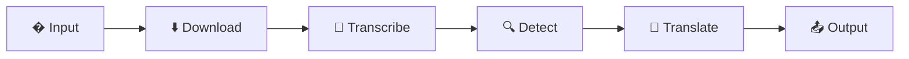
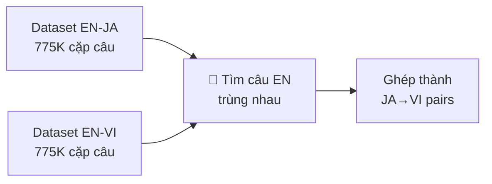
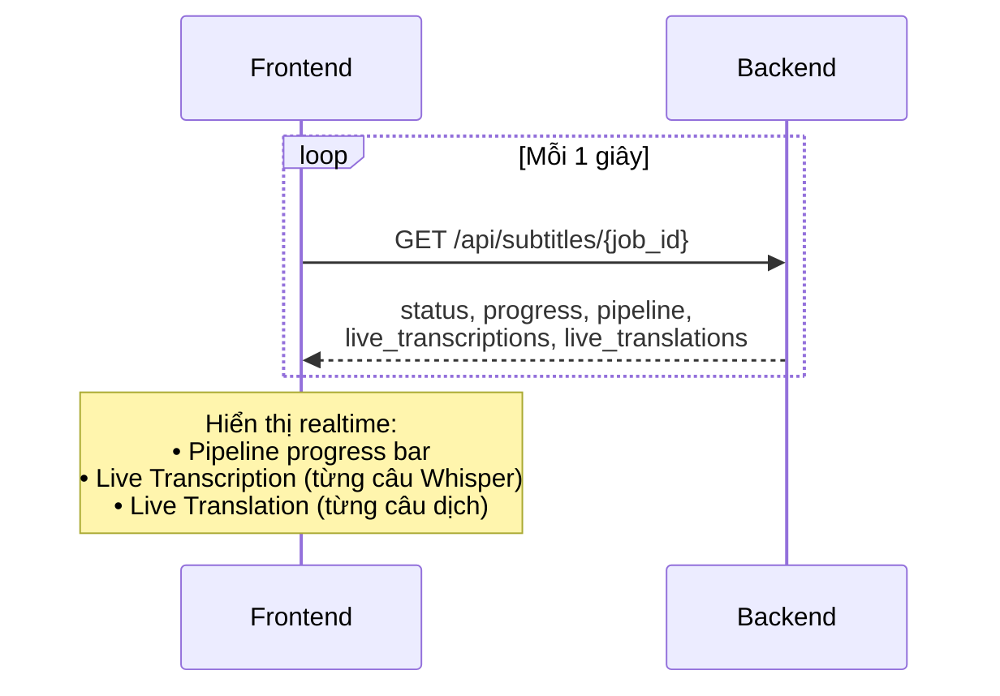

# 🌐 Agent-Translate — Luồng Xử Lý Dự Án

> Hệ thống dịch phụ đề video đa ngôn ngữ, tập trung xử lý NLP (Natural Language Processing)

---

## 1. Tổng Quan Hệ Thống

**Agent-Translate** nhận đầu vào là URL video YouTube, tự động trích xuất phụ đề từ audio, phát hiện ngôn ngữ, dịch sang tiếng Việt bằng các mô hình NLP đã được fine-tune, và xuất file phụ đề SRT.

Hệ thống gồm 3 thành phần:
- **Frontend** (React): Giao diện người dùng, hiển thị tiến trình realtime
- **Backend** (FastAPI): Xử lý pipeline, quản lý models, phục vụ API
- **NLP Engine**: Các mô hình AI cho speech-to-text, phát hiện ngôn ngữ, dịch thuật

---

## 2. Luồng Xử Lý Chính — 6 Bước Pipeline



### Bước 1: Input — Nhận đầu vào

- Người dùng nhập **URL YouTube** hoặc **upload file video** trên giao diện
- Chọn **ngôn ngữ đích** (mặc định: Tiếng Việt)
- Chọn **model Whisper** để trích xuất phụ đề (Base / Small / Large-V3)
- Chọn **model dịch** (NLLB / M2M-100 / OpusMT / tự động chọn)
- Hệ thống tạo một **Job ID** duy nhất và bắt đầu xử lý nền (background)

### Bước 2: Download — Tải audio từ video

- Sử dụng thư viện **yt-dlp** để tải audio từ YouTube
- Lấy thông tin video: **tên video**, **thời lượng**
- Chuyển đổi audio sang định dạng **WAV 16kHz mono** bằng FFmpeg
- Đây là format chuẩn mà Whisper yêu cầu

### Bước 3: Transcribe — Trích xuất phụ đề (Speech-to-Text)

> **Công nghệ NLP: Automatic Speech Recognition (ASR)**

- Sử dụng **OpenAI Whisper** — mô hình ASR đa ngôn ngữ
- Whisper xử lý audio và tạo ra danh sách **segments**, mỗi segment gồm:
  - **Thời gian bắt đầu** và **kết thúc**
  - **Văn bản** đã nhận diện
- Áp dụng **VAD (Voice Activity Detection)** để loại bỏ khoảng lặng, tăng độ chính xác
- Whisper cũng đồng thời **phát hiện ngôn ngữ** của audio (ví dụ: "en" với xác suất 94%)
- **Realtime**: Mỗi segment được gửi lên frontend ngay khi Whisper nhận diện xong, hiển thị trên panel **Live Transcription**

| Model Whisper | Kích thước | Tốc độ (video 12 phút) | Độ chính xác |
|--------------|-----------|----------------------|-------------|
| Base | 74 MB | ~2-3 phút | Tốt |
| Small | 244 MB | ~5-8 phút | Rất tốt |
| Large-V3 | 3 GB | ~30-60 phút | Xuất sắc |

### Bước 4: Detect — Phát hiện ngôn ngữ

> **Công nghệ NLP: Language Identification**

Hệ thống sử dụng chiến lược phát hiện kết hợp:

1. **Whisper Detection** (ưu tiên cao): Whisper đã phát hiện ngôn ngữ chính từ toàn bộ audio ở bước trước — đây là kết quả chính xác nhất vì phân tích cả file
2. **CJK Character Check**: Kiểm tra ký tự đặc biệt để phân biệt nhanh Nhật (Hiragana/Katakana), Hàn (Hangul), Trung (chữ Hán)
3. **langdetect** (fallback): Thư viện phát hiện ngôn ngữ cho các trường hợp còn lại

Kết quả: Xác định được ngôn ngữ của từng segment → phân loại vào nhóm dịch phù hợp

### Bước 5: Translate — Dịch thuật

> **Công nghệ NLP: Neural Machine Translation (NMT)**
> 
> **Đây là bước cốt lõi của toàn bộ hệ thống**

#### 5.1 Phân loại segments vào 3 đường dịch

Sau khi phát hiện ngôn ngữ, hệ thống chia các segments thành 3 nhóm:

| Nhóm | Điều kiện | Xử lý |
|------|----------|-------|
| **LOCAL** | Tiếng Anh + có model local (NLLB/M2M/OpusMT) | Dịch bằng model đã fine-tune |
| **NLLB Base** | Ngôn ngữ khác (Nhật, Trung, Hàn...) | Dịch bằng NLLB-200 base model |
| **SKIP** | Trùng ngôn ngữ đích | Giữ nguyên, không dịch |

#### 5.2 Hệ thống chọn Model tự động (Priority System)

Khi cần dịch, hệ thống tự động chọn model tốt nhất theo thứ tự ưu tiên:

```
Ưu tiên 0 (cao nhất): NLLB/M2M Direct Fine-tuned
    → Model đã được huấn luyện riêng cho cặp ngôn ngữ này
    → Ví dụ: nllb-ja-vi-direct (Nhật→Việt trực tiếp)

Ưu tiên 1: OpusMT Fine-tuned  
    → Model nhẹ, đã fine-tune  
    → Ví dụ: ft-opus-en-vi-v2 (Anh→Việt)

Ưu tiên 2: Base Model (pre-trained, chưa fine-tune)
    → Model gốc chưa huấn luyện thêm
    → Ví dụ: opus-mt-tc-big-en-ko (Anh→Hàn)

Fallback: NLLB-200 Base (200 ngôn ngữ)
    → Dùng cho bất kỳ cặp ngôn ngữ nào không có model riêng
```

#### 5.3 Cơ chế forced_bos_token_id — Điều khiển ngôn ngữ đích

> [!IMPORTANT]
> Đây là chi tiết kỹ thuật NLP quan trọng nhất trong dự án

**Vấn đề**: NLLB và M2M-100 là các **multilingual models** hỗ trợ hàng trăm ngôn ngữ. Khi generate text, nếu không chỉ định ngôn ngữ đích, model sẽ **output ngẫu nhiên** — có thể ra tiếng Rumani, Hy Lạp, Tây Ban Nha... thay vì tiếng Việt.

**Giải pháp**: Sử dụng `forced_bos_token_id` — ép token đầu tiên của output phải là **mã ngôn ngữ đích**:

| Model | Cách set ngôn ngữ đích | Ví dụ cho Tiếng Việt |
|-------|----------------------|---------------------|
| **NLLB-200** | FLORES-200 language code | `vie_Latn` → token ID 256193 |
| **M2M-100** | ISO language code | `vi` → token ID 128097 |
| **OpusMT** | Không cần — model đã train riêng cho 1 cặp ngôn ngữ | — |

Khi đó model sẽ **bắt buộc** sinh văn bản tiếng Việt ở output.

#### 5.4 Quy trình dịch Batch

- Segments được chia thành **batch 8 câu** để tối ưu tốc độ
- Mỗi batch qua 3 bước: **Tokenize** (chuyển text → số) → **Generate** (model sinh bản dịch) → **Decode** (chuyển số → text)
- Kết quả mỗi câu được gửi lên frontend **realtime** qua panel **Live Translation**
- Backend log từng câu dịch với format: `[1/51] 🇬🇧→🇻🇳 "Hello" → "Xin chào"`

#### 5.5 Chiến lược Pivot Translation

Khi không có model dịch trực tiếp (ví dụ: Thái→Việt), hệ thống dùng **dịch qua trung gian**:

```
Ngôn ngữ X  →  NLLB base  →  Tiếng Anh  →  Local model  →  Tiếng Việt
   (Thái)                       (pivot)                       (đích)
```

Chiến lược pivot giúp hệ thống **hỗ trợ bất kỳ ngôn ngữ nào** mà không cần fine-tune model riêng.

### Bước 6: Output — Xuất kết quả

- Tạo **3 file SRT**:
  - `original.srt` — phụ đề gốc
  - `translated_vi.srt` — phụ đề đã dịch tiếng Việt
  - `bilingual_vi.srt` — phụ đề song ngữ (gốc + dịch mỗi dòng)
- Cập nhật trạng thái job thành **"completed"**
- Frontend hiển thị kết quả với 3 tab: **Original** / **Translated** / **Side by Side**

---

## 3. Training Pipeline — Huấn Luyện Mô Hình NLP

### 3.1 Vấn đề Data

Để fine-tune model dịch, cần **cặp câu song ngữ** (parallel corpus). Tuy nhiên:
- Data **EN↔VI** có sẵn nhiều (775K+ cặp câu từ OPUS-100)
- Data **JA→VI**, **ZH→VI** rất ít hoặc **không tồn tại**

### 3.2 Giải pháp: Bridge Matching

> **Sáng tạo**: Tạo data dịch trực tiếp bằng cách "nối cầu" qua tiếng Anh



**Logic**: Nếu câu tiếng Anh giống nhau trong cả 2 dataset → ghép câu Nhật với câu Việt tương ứng

**Ví dụ**:
| Dataset EN-JA | Câu EN chung | Dataset EN-VI |
|--------------|-------------|---------------|
| "猫が好きです" | "I like cats" | "Tôi thích mèo" |

→ Tạo pair: **"猫が好きです" → "Tôi thích mèo"**

### 3.3 Quy trình Training

1. **Thu thập data**: Download từ OPUS-100 hoặc Bridge Matching
2. **Tiền xử lý**: Tokenize text (SentencePiece/BPE), chia train/eval (95/5)
3. **Fine-tuning**: Huấn luyện model gốc trên data mới
   - 3 epochs, learning rate thấp (1e-5) để không phá kiến thức gốc
   - Batch size 16, gradient accumulation 4 → effective batch 64
   - Chạy trên **CPU** (model 2.4GB quá lớn cho MPS GPU)
4. **Lưu model**: Checkpoint tốt nhất → `training_runs/{model}/final/`

### 3.4 Mô hình đã huấn luyện

| Model | Cặp ngôn ngữ | Data Training | Kết quả (Loss) |
|-------|-------------|--------------|----------------|
| NLLB EN→VI Direct | Anh → Việt | 5,000 pairs | 39.99 |
| NLLB JA→VI Direct | Nhật → Việt | 5,000 pairs (Bridge) | 39.99 |
| M2M-100 EN→VI | Anh → Việt | 5,000 pairs | — |
| OpusMT EN→VI v2 | Anh → Việt | 20,000 pairs | 1.83 |
| OpusMT EN→VI | Anh → Việt | 10,000 pairs | 2.10 |
| OpusMT EN→JA | Anh → Nhật | 20,000 pairs | 2.15 |
| OpusMT EN→ZH | Anh → Trung | 20,000 pairs | 1.95 |

---

## 4. So Sánh 3 Loại Model NLP

| Tiêu chí | NLLB-200 | M2M-100 | OpusMT |
|----------|----------|---------|--------|
| **Base model** | Meta AI | Facebook AI | Helsinki NLP |
| **Kiến trúc** | Transformer Seq2Seq | Transformer Seq2Seq | MarianMT (Transformer nhẹ) |
| **Số tham số** | 600 triệu | 418 triệu | 74 triệu |
| **Kích thước** | 2.4 GB | 1.9 GB | ~300 MB |
| **Số ngôn ngữ** | 200 ngôn ngữ | 100 ngôn ngữ | 1 cặp ngôn ngữ |
| **Cần forced_bos** | ✅ Có | ✅ Có | ❌ Không |
| **Ưu điểm** | Chất lượng cao, nhiều ngôn ngữ | Cân bằng chất lượng/tốc độ | Nhanh, nhẹ |
| **Nhược điểm** | Nặng, chậm trên CPU | Nặng vừa | Chỉ 1 cặp ngôn ngữ |

---

## 5. Luồng Dữ Liệu Realtime

Frontend liên tục polling backend mỗi **1 giây** để cập nhật:



- **Step Transcribe**: Panel Live Transcription hiện từng segment khi Whisper nhận diện
- **Step Translate**: Panel Live Translation hiện từng câu dịch khi model xử lý  
- **Step Output**: Hiển thị file SRT kết quả và bảng so sánh song ngữ

---

## 6. Tổng Kết

| Khía cạnh | Chi tiết |
|-----------|---------|
| **Mục tiêu** | Dịch phụ đề video YouTube → Tiếng Việt |
| **NLP Core** | Transformer Seq2Seq: NLLB + M2M-100 + OpusMT |
| **Đặc biệt** | Bridge Matching tự tạo data, forced_bos_token_id, realtime display |
| **Models** | 7 fine-tuned + 1 base = **8 models** |
| **Ngôn ngữ** | EN, JA, ZH, KO → VI (+ 200 ngôn ngữ qua NLLB base) |
| **Pipeline** | Input → Download → Transcribe → Detect → Translate → Output |
